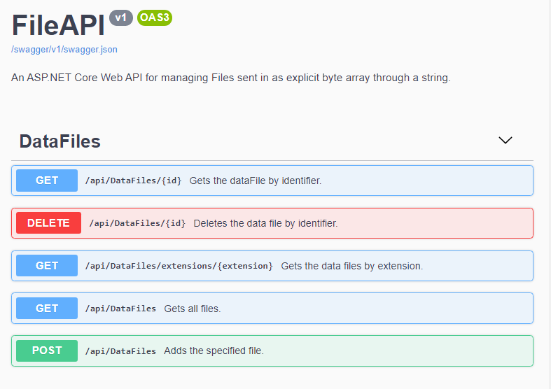
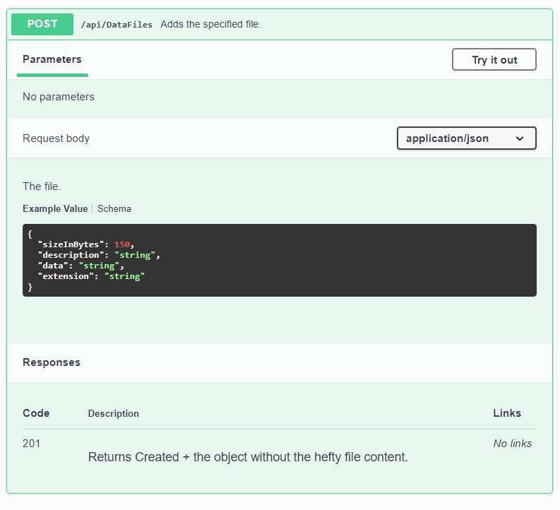
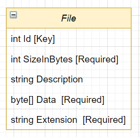
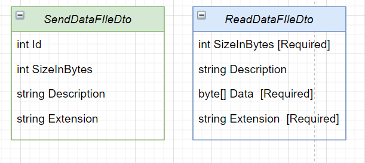

# A REST API web application to save, retrieve and maintain information about small Files of any type.
This api serves as a repository for small files. For now, files are uploaded with their entire content specified as a string.
The API is not available yet. This is only a prototype version.
## The Interface
The interface is described below with a generated swagger interface page...

    

An example of a POST request can be found below.

    

## The model
The database model for a basic DataFIle is presented below.

    

### The data models
For some requests, data models are returned instead of the full database model.
For instance, when uploading a single object with a GET/{id} request, only a partial data object without the data contents is returned.

    

## Planned updates
- Adding put and fetch request endpoints.
- Expanding the data model.
- Live hosting of the API.
- Connections with other services.
- Creating a frontEnd MVC app.

*© Copyright Andrew Coachman 2021, all rights included*